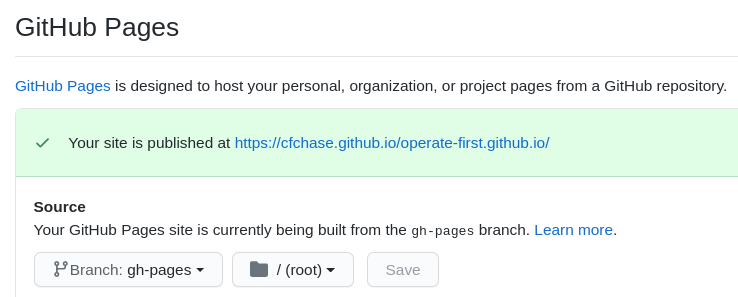

# Operate First Website

This repository contains some content and the code to build [operate-first.cloud](https://www.operate-first.cloud/). It is based on [Gatsby](https://www.gatsbyjs.com/) and can be deployed to [OpenShift](scripts/templates/base) or [GitHub Pages](https://pages.github.com/).

## Adding Content

We want to make it really easy for content contributors to add their material to the website.
Content can be added directly to this repository or from a remote repository. The latter is the preferred way, so that content creators dont need to duplicate their content into this repository.
This site is merely an aggregator.

### Remote Content

Prefer adding content remotely to this website. This means, your content is in another git repository and you configure this site to pull in the content. You'll only add entries to the sitemap, so that your content can be accessed via links.

Add a [gatsby-source-git](https://www.gatsbyjs.com/plugins/gatsby-source-git/) section to [gatsby-config.js](gatsby-config.js).

```js
{
  resolve: `gatsby-source-git`,
  options: {
    name: `data-science/ocp-ci-analysis`,
    remote: `https://github.com/aicoe-aiops/ocp-ci-analysis.git`,
    patterns: [`**/*.md`, `**/*.ipynb`],
  }
},
```

The `name` for the plugin will be the prefix for URLs generated from that repository.
In the following example, all Markdown and JupyterNotebook files will be rendered as pages under the `/data-science/ocp-ci-analysis` path.

The [notebooks/TestGrid_EDA.ipynb](https://github.com/aicoe-aiops/ocp-ci-analysis/blob/master/notebooks/TestGrid_EDA.ipynb) Notebook will be rendered at [/data-science/ocp-ci-analysis/notebooks/TestGrid_EDA/](http://www.operate-first.cloud/data-science/ocp-ci-analysis/notebooks/TestGrid_EDA/).

### Local Content

All local content goes into the [/content](/content) folder. All files will be available as pages, starting from the root URL of the site.

For example, to add content locally to the `blueprints` category, create a document located at `content/blueprints/my_doc.md`.

### Supported File Types

Files formatted as 
* [Markdown .md](https://daringfireball.net/projects/markdown/)
* [JupyterNotebook .ipynb](https://jupyter.org/)
* [MarkdownX .mdx](https://mdxjs.com/)

#### Markdown

Markdown files can be prefixed with [frontmatter](https://www.gatsbyjs.com/docs/adding-markdown-pages/#frontmatter-for-metadata-in-markdown-files). 

See [/content/examples/markdown.md](/content/examples/markdown.md) rendered [here](https://www.operate-first.cloud/examples/markdown)

```markdown
---
title: My Document
description: My Document Description
---

# Content goes here

valid markdown
```

#### JupyterNotebook

Any file with the `.ipynb` extension will be rendered as HTML. This is done via the [gatsby-transformer-ipynb](https://www.gatsbyjs.com/plugins/@rafaelquintanilha/gatsby-transformer-ipynb/).

See [/content/examples/jupyter_notebook.ipynb](/content/examples/jupyter_notebook.ipynb) rendered [here](https://www.operate-first.cloud/examples/jupyter_notebook)

#### MDX

Similar to Markdown, but you can add [React Components](https://www.gatsbyjs.com/docs/glossary#component), which basically extend HTML. E.g. you can embedd a JupyterNotebook into the MDX file.

See [/content/examples/mdx.mdx](/content/examples/mdx.mdx) rendered [here](https://www.operate-first.cloud/examples/mdx)


```markdown
---
title: My MDX
description: MarkdownX
---

This is how I include a Notebook:

<JupyterNotebook path="jupyter_notebook.ipynb"/>
```

### Site structure

Content will be added to one of the four categories on this website:

* **data-science**: Examples of data science projects for the data science users that want to learn about data science on ODH.
* **users**: Documentation for all users of ODH. Access details of various deployed ODH components.
* **operators**: Examples and documentation from operators of ODH. 
* **blueprints**: Generic information that can be applied to other projects as well.


#### Configuring Table of Contents

Whether adding content remotely, or locally, the content needs to be added to the vertical navigation bar on the left and will belong to one of the four categories.

The `content` directory contains `category.yaml` files for each category eg: `blueprints.yaml` for the Blueprints category and this file will contain the table of content navigation items for each document that you add.

The (`.yaml`) config looks as follows:

```yaml
- id: my-uniq-id
  label: The Navigation Item
  href: /the/url/to/the/page
```

Following is an example of 2 level hierarchy from a repo, for cases where you have to add more than one document from a repository as remote content.

```yaml
- id: continuous-delivery
  label: Continuous Delivery
  links:
    - id: cicd_intro
      label: (Opinionated) Continuous Delivery
      href: /blueprints/continuous-delivery/docs/continuous_delivery
    - id: continuous-delivery-setup-source-operations
      label: Setting up Source Code Operations
      href: /blueprints/continuous-delivery/docs/setup_source_operations
```


## Local Development

You can run the app locally to preview your changes.
In terminal:

```shell script
make dev
```

If you have problems, run `make dev-clean`

### Previewing your changes on GitHub pages

When previewing your changes on a fork.

First, enable github pages to use the gh-pages branch from root.



Make sure to push your changes to your branch on the fork.

Then, from your branch manually build and push.

```shell script
make gh-pages-fork
```

Now you can view your work on `https://githubuserid.github.io/operate-first.github.io`

### Previewing multiple PRs on GitHub pages

If you've set up to preview the site on your personal GitHub pages, like the above, you can also preview multiple PR branches from your fork under separate paths. For example, for a branch named `my-branch`, would deploy under a subpath of the same name.

From your branch manually build and push.

```shell script
make gh-pages-branch
```

Now you can view your work on `https://githubuserid.github.io/operate-first.github.io/my-branch`

### Manual Site Deployment (Production GitHub Pages)

[CI](https://travis-ci.org/github/operate-first/operate-first.github.io) should deploy to GitHub pages automatically, but to manually redeploy

```shell script
make gh-pages
```

## Building the site in a container

Customize your `.env` file similar to `.env.default`(.env.default)

#### Building a containerized image

Customize `.env` file to image and source information as desired. `npm` and the `s2i` command line tool is required. [https://github.com/openshift/source-to-image](https://github.com/openshift/source-to-image)

```.env
IMAGE_REPOSITORY=quay.io/my-org/operate-first-app:latest
SOURCE_REPOSITORY_URL=git@github.com:my-org/operate-first.github.io.git
SOURCE_REPOSITORY_REF=my-branch
```

```shell script
make build
```

#### Pushing the container image

Customize `.env` file to image information and container builder.

```.env
CONTAINER_BUILDER=docker
IMAGE_REPOSITORY=quay.io/my-org/odh-dashboard:latest
```

```shell script
make push
```

#### Deploying to OpenShift

Customize `.env` file for deployment information. Required. `oc` command line tool is required.

```.env
OC_URL=https://api.my-host:6443
OC_PROJECT=operate-first
# user and password login
OC_USER=kubeadmin
OC_PASSWORD=my_password
```

or

```.env
OC_URL=https://api.my-host:6443
OC_PROJECT=operate-first
# token login
OC_TOKEN=my_token
```

Run:

```shell script
make deploy
```
