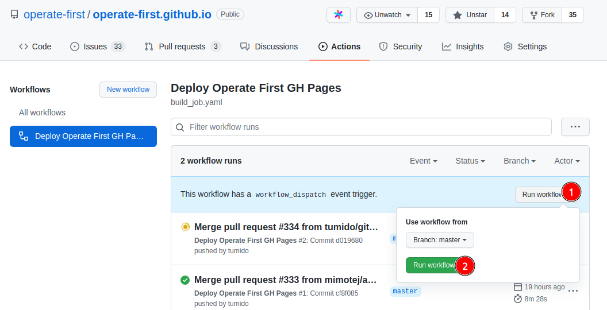

# Operate First Website


[](https://github.com/operate-first/operate-first.github.io/actions/workflows/build_job.yaml)

This repository contains some content and the code to build [operate-first.cloud](https://www.operate-first.cloud/). It is based on [Gatsby](https://www.gatsbyjs.com/) and can be deployed to [OpenShift](https://www.redhat.com/en/technologies/cloud-computing/openshift) or [GitHub Pages](https://pages.github.com/).

## Adding Content

We want to make it really easy for content contributors to add their material to the website.
Content can be added directly to this repository or from a remote repository. The latter is the preferred way, so that content creators dont need to duplicate their content into this repository.
This site is merely an aggregator.

### Remote Content

Prefer adding content remotely to this website. This means, your content is in another git repository and you configure this site to pull in the content. You'll only add entries to the sitemap, so that your content can be accessed via links.

Add a [gatsby-source-git](https://www.gatsbyjs.com/plugins/gatsby-source-git/) section to [gatsby-config.js](gatsby-config.js).

```js
{
  resolve: `gatsby-source-git`,
  options: {
    name: `data-science/ocp-ci-analysis`,
    remote: `https://github.com/aicoe-aiops/ocp-ci-analysis.git`,
    patterns: [`**/*.md`, `**/*.ipynb`],
  }
},
```

The `name` for the plugin will be the prefix for URLs generated from that repository.
In the following example, all Markdown and JupyterNotebook files will be rendered as pages under the `/data-science/ocp-ci-analysis` path.

The [notebooks/data-sources/TestGrid/testgrid_EDA.ipynb](https://github.com/aicoe-aiops/ocp-ci-analysis/blob/master/notebooks/data-sources/TestGrid/testgrid_EDA.ipynb) Notebook will be rendered at [/data-science/ocp-ci-analysis/notebooks/data-sources/TestGrid/testgrid_EDA.ipynb](http://www.operate-first.cloud/data-science/ocp-ci-analysis/notebooks/data-sources/TestGrid/testgrid_EDA.ipynb).

### Local Content

All local content goes into the [/content](/content) folder. All files will be available as pages, starting from the root URL of the site.

For example, to add content locally to the `blueprints` category, create a document located at `content/blueprints/my_doc.md`.

### Supported File Types

Files formatted as

* [Markdown .md](https://daringfireball.net/projects/markdown/)
* [JupyterNotebook .ipynb](https://jupyter.org/)
* [MarkdownX .mdx](https://mdxjs.com/)

#### Markdown

Markdown files can be prefixed with [frontmatter](https://www.gatsbyjs.com/docs/adding-markdown-pages/#frontmatter-for-metadata-in-markdown-files).

See [/content/examples/markdown.md](/content/examples/markdown.md) rendered [here](https://www.operate-first.cloud/examples/markdown.md)

```markdown
---
title: My Document
description: My Document Description
---

# Content goes here

valid markdown
```

To add videos to Markdown follow the instructions given in [/content/examples/markdown.md#add-videos](/content/examples/markdown.md#add-videos)

#### JupyterNotebook

Any file with the `.ipynb` extension will be rendered as HTML. This is done via the [gatsby-transformer-ipynb](https://www.gatsbyjs.com/plugins/@rafaelquintanilha/gatsby-transformer-ipynb/).

See [/content/examples/jupyter_notebook.ipynb](/content/examples/jupyter_notebook.ipynb) rendered [here](https://www.operate-first.cloud/examples/jupyter_notebook.ipynb)

#### MDX

Similar to Markdown, but you can add [React Components](https://www.gatsbyjs.com/docs/glossary#component), which basically extend HTML. E.g. you can embedd a JupyterNotebook into the MDX file.

See [/content/examples/mdx.mdx](/content/examples/mdx.mdx) rendered [here](https://www.operate-first.cloud/examples/mdx.mdx)

```markdown
---
title: My MDX
description: MarkdownX
---

This is how I include a Notebook:

<JupyterNotebook path="jupyter_notebook.ipynb"/>
```

### Linking

All links should be added as relative links, i.e. they should not start with a `/`.
If you link to another document in your own content repository,
then a relative link will work when the content is rendered at GitHub *and* it will work in the gatsby site.

`index.md` and `README.md` files will be treated as index files. Their name will be stripped from the URL.
E.g. `/folder/README.md` would result in `/folder/`

### Site structure

Content will be added to one of the four categories on this website:

* **data-science**: Examples of data science projects for the data science users that want to learn about data science on ODH.
* **users**: Documentation for all users of ODH. Access details of various deployed ODH components.
* **operations**: Documentation pertaining to Operate First operation procedures.
* **blueprints**: Generic information that can be applied to other projects as well.
* **community**: Operate First news, code of conduct, and other pertinent information to the Operate First community

#### Configuring Table of Contents

Whether adding content remotely, or locally, the content needs to be added to the vertical navigation bar on the left and will belong to one of the four categories.

The `config` directory contains `category.yaml` files for each category eg: `blueprints.yaml` for the Blueprints category and this file will contain the table of content navigation items for each document that you add.

```yaml
- label: The Navigation Item
  href: /the/url/to/the/page
```

Following is an example of 2 level hierarchy from a repo, for cases where you have to add more than one document from a repository as remote content.

```yaml
- label: Continuous Delivery
  links:
    - label: (Opinionated) Continuous Delivery
      href: /blueprints/continuous-delivery/docs/continuous_delivery
    - label: Setting up Source Code Operations
      href: /blueprints/continuous-delivery/docs/setup_source_operations
```

## Local Development

You can run the app locally to preview your changes.
In terminal:

```sh
npm install
npm run dev
```

In case of stale cache or errors, please try:

```sh
npm run clean
```

### Previewing your changes on GitHub pages

We use Netlify to preview PR changes. Each PR will show a Netlify check that can be used to access a dynamically generated build and deployment of that PR.

### Manual Site Deployment (Production GitHub Pages)

CI will deploy to GitHub pages automatically on every push to default branch as well on daily schedule. You can trigger a new build manually if you have _write_ permissions on this repo by simply clicking **Run workflow** button on the [CI workflow details screen here](https://github.com/operate-first/operate-first.github.io/actions/workflows/build_job.yaml).



Fully manual build is possible by issuing following commands (requires _write_ access to the repo):

```sh
npm install
npm deploy
```
