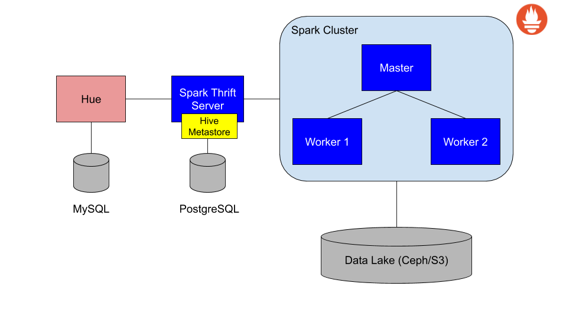
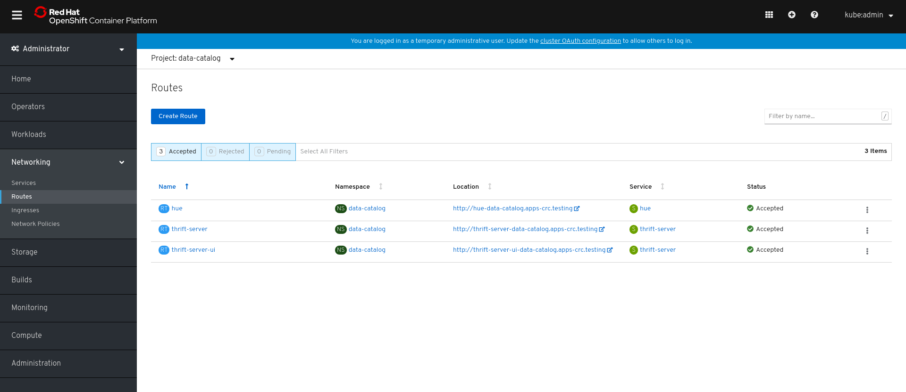
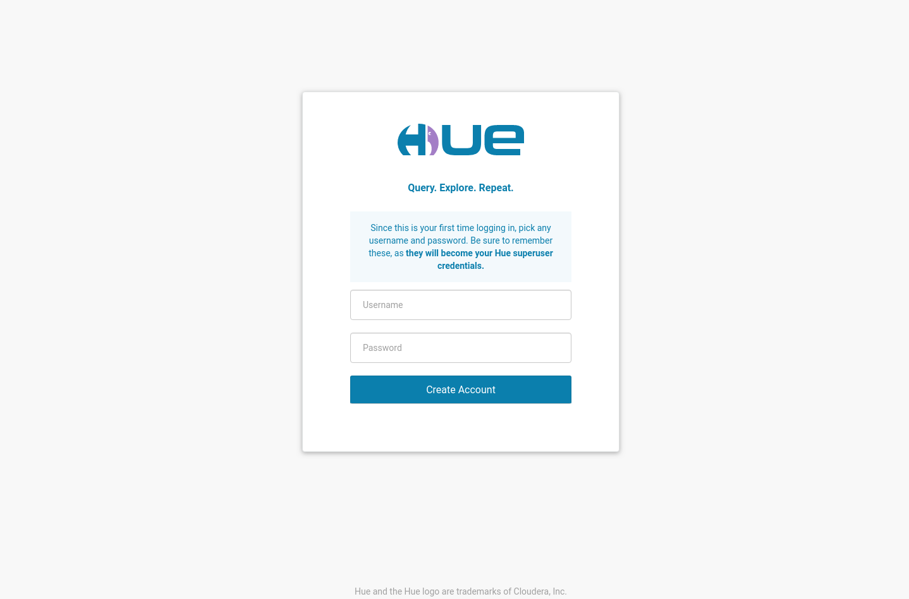
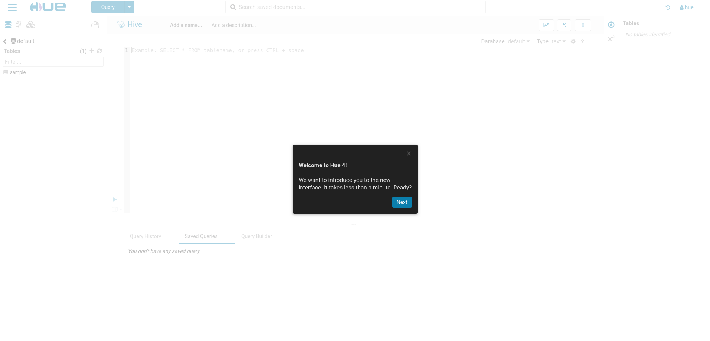
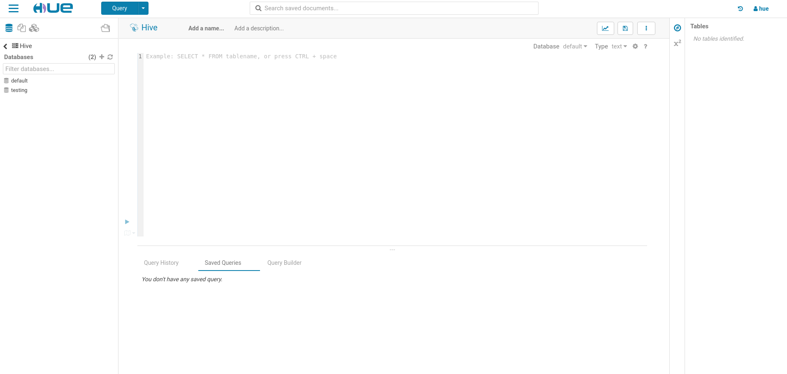
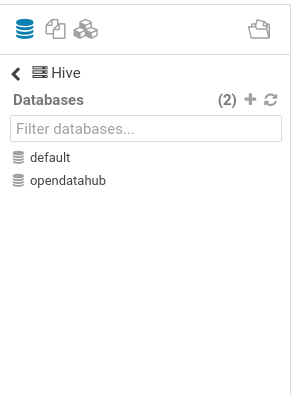
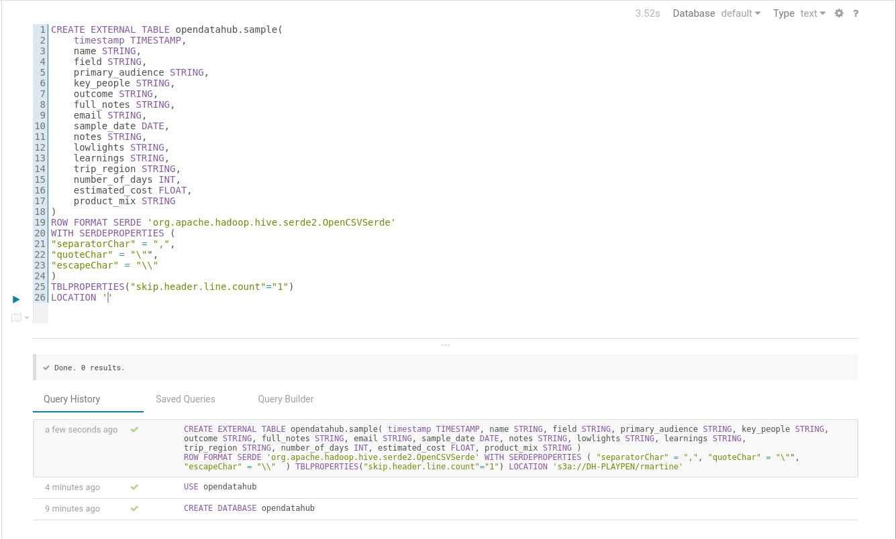
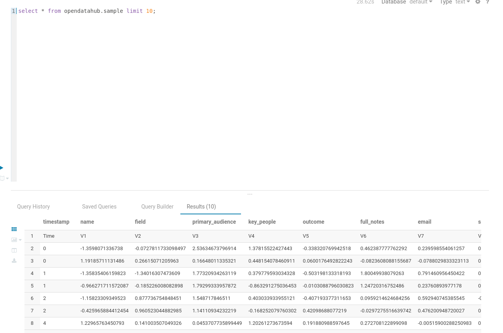

## Pre-requisites

This tutorial requires that you followed the [basic tutorial](basic-tutorial). Make sure you enabled the following components in Open Data Hub CR:

- spark-operator
- data-catalog

All screenshots and instructions are from OpenShift 4.2.

## Exploring Data Catalog

The Data Catalog is a set of components with which you can
read data stored in Data Lakes, create tables and query them in a SQL-like style. You can find
below a picture of the simplified architecture of Data Catalog:



These are the components that are part of Data Catalog:

- Hive Metastore, responsible for maintaining the table metadata created by the user to query the data stored in Ceph/S3
- Spark SQL Thrift server to enable an endpoint where clients can connect using an ODBC/JDBC connection
- Cloudera Hue as a Data Exploration tool to explore the Data Lake, create tables and query them. You can
  also create dashboards using the tables managed by Hive Metastore

## Using Data Catalog

1. Find the route to Hue. Within your Open Data Hub Project click on Networking -> Routes
   

2. For the route named hue, click on the location to bring up Hue (typically `http://hue-project.apps.your-cluster.your-domain.com`).

3. It will open the first-time login page where you can create the superuser for Hue.
   

4. As the first login, Hue will show a tutorial about the interface. You can skip the tutorial by closing the window.
   

5. The Hue editor will appear in a blank textarea.
   

Now we can create a table from a file inside the Data Lake.

## Creating and querying tables

1. Let's create first a database with the following command (You can run the query by either clicking on the play button in the left or type Ctrl+Enter):

```
CREATE DATABASE opendatahub;
```

2. In the explorer, click on the refresh button. The new database will appear:
   {:class="img-auto"}

3. Now let's select the database with the command:

```
USE opendatahub;
```

4. We will create a table from the `sample_data.csv` file used in the `Basic Tutorial` section:

```
CREATE EXTERNAL TABLE opendatahub.sample(
    timestamp TIMESTAMP,
    name STRING,
    field STRING,
    primary_audience STRING,
    key_people STRING,
    outcome STRING,
    full_notes STRING,
    email STRING,
    sample_date DATE,
    notes STRING,
    lowlights STRING,
    learnings STRING,
    trip_region STRING,
    number_of_days INT,
    estimated_cost FLOAT,
    product_mix STRING
)
ROW FORMAT SERDE 'org.apache.hadoop.hive.serde2.OpenCSVSerde'
WITH SERDEPROPERTIES (
"separatorChar" = ",",
"quoteChar" = "\"",
"escapeChar" = "\\"
)
TBLPROPERTIES("skip.header.line.count"="1")
LOCATION 's3a://<csv-file-location>'
```

**NOTE:** The `LOCATION` statement needs a path to the directory where the file is stored, not the file path.

5. You will see the result of table creation.
   

6. We can now query the data.

```
select * from opendatahub.sample limit 10;
```

7. Check the query results in Hue.
   
