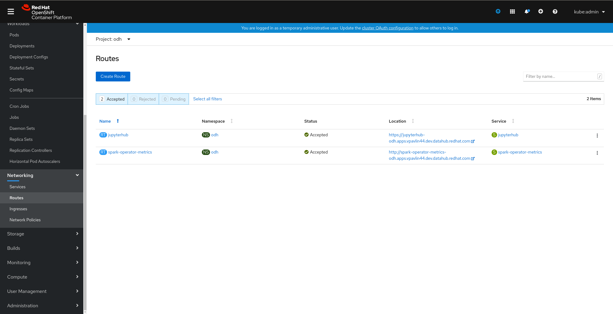
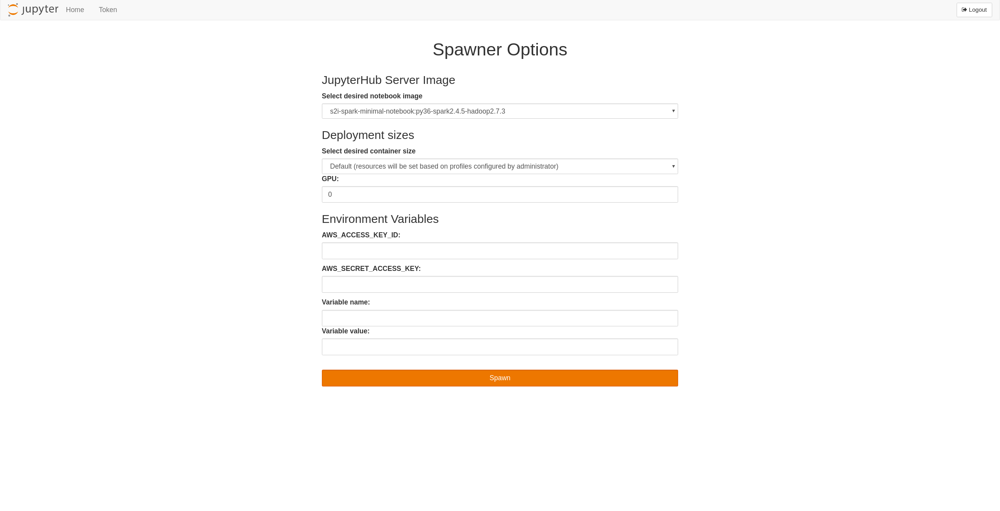

### Pre-requisites

This Tutorial requires a basic installation of Open Data Hub with Spark and JupyterHub as detailed in the [quick installation](/quick-installation). The quick installation steps are also available as a <a class="external-link" href="https://www.youtube.com/watch?v=-T6ypF7LoKk&t=2s" target="_blank"><i class="fas fa-external-link-alt"></i>tutorial video</a> on the OpenShift youtube channel.

All screenshots and instructions are from OpenShift 4.4. For the purposes of this tutorial, we used [try.openshift.com](https://try.openshift.com/) on AWS. Tutorials have also been tested on [Code Ready Containers](https://code-ready.github.io/crc/) with 16GB of RAM.

The [source](./basic_tutorial_notebook.ipynb) for the following notebook is available in GitLab with comments for easy viewing.

### Exploring JupyterHub and Spark

JupyterHub and Spark are installed by default with Open Data Hub. You can create Jupyter Notebooks and connect to Spark. This is a simple `hello world` example.

1.  Find the route to JupyterHub. Within your Open Data Hub Project click on `Networking` -> `Routes`
    
1.  For the route named `jupyterhub`, click on the location to bring up JupyterHub (typically `https://jupyterhub-project.apps.your-cluster.your-domain.com`).
1.  Sign in using your OpenShift credentials.
1.  Spawn a new server with spark functionality. (e.g. `s2i-spark-minimal-notebook:py36-spark2.4.5-hadoop2.7.3`)
    
1.  Create a new Python 3 notebook
1.  Copy the following code to test a basic spark connection.

    ```python
    from pyspark.sql import SparkSession, SQLContext
    import os
    import socket

    # create a spark session
    spark_cluster_url = f"spark://{os.environ['SPARK_CLUSTER']}:7077"
    spark = SparkSession.builder.master(spark_cluster_url).getOrCreate()

    # test your spark connection
    spark.range(5, numPartitions=5).rdd.map(lambda x: socket.gethostname()).distinct().collect()
    ```

1.  Run the notebook. If successful, you should see the output similar to the following:
    ```
    ['spark-cluster-kube-3aadmin-w-gx7rm', 'spark-cluster-kube-3aadmin-w-xvl55']
    ```

### Object Storage

Let's add on to the notebook from the previous section and access data on an Object Store (such as Ceph or AWS S3) using the S3 API. For instructions on installing Ceph, refer to the Advanced Installation [documentation]({{site.baseurl}}/docs/administration/advanced-installation/object-storage.html).

1.  Click on the `+` button and insert a new cell of type `Code`.
1.  To access S3 directly, we'll use the `boto3` library. We'll download a sample data file and then upload it to our S3 storage. In the new cell paste the following code, and edit the `s3_` variables with your own credentials.

    ```python
    # Edit this section using your own credentials
    s3_region = 'region-1' # fill in for AWS, blank for Ceph
    s3_endpoint_url = 'https://s3.storage.server'
    s3_access_key_id = 'AccessKeyId-ChangeMe'
    s3_secret_access_key = 'SecretAccessKey-ChangeMe'
    s3_bucket = 'MyBucket'

    # for easy download
    !pip install wget

    import wget
    import boto3

    # configure boto S3 connection
    s3 = boto3.client('s3',
                      s3_region,
                      endpoint_url = s3_endpoint_url,
                      aws_access_key_id = s3_access_key_id,
                      aws_secret_access_key = s3_secret_access_key)

    # download the sample data file
    url = "{{site.repo}}/opendatahub.io/raw/master/assets/files/tutorials/basic/sample_data.csv"
    file = wget.download(url=url, out='sample_data.csv')

    #upload the file to storage
    s3.upload_file(file, s3_bucket, "sample_data.csv")
    ```

1.  Run the cell. After it completes check your S3 bucket. You should see the `sample_data.csv`.

### Spark + Object Storage

Now, let's access that same data file from Spark so you can analyze the data.

1.  Let's read the data using Spark. First, click on the `+` button and insert a new cell of type `Code`.
1.  Paste the following code to read the data using Spark and print the first few rows of data.

    ```python
    hadoopConf = spark.sparkContext._jsc.hadoopConfiguration()
    hadoopConf.set("fs.s3a.endpoint", s3_endpoint_url)
    hadoopConf.set("fs.s3a.access.key", s3_access_key_id)
    hadoopConf.set("fs.s3a.secret.key", s3_secret_access_key)
    hadoopConf.set("fs.s3a.path.style.access", "true")
    hadoopConf.set("fs.s3a.connection.ssl.enabled", "true") # false if not https

    data = spark.read.csv('s3a://' + s3_bucket + '/sample_data.csv',sep=",", header=True)
    df = data.toPandas()
    df.head()
    ```

1.  Run the cell. The data from the `csv` file should be displayed as a Pandas data frame.

That's it! You have a working Jupyter notebook workspace with access to S3 storage and Spark.
