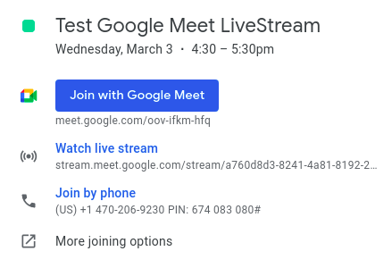
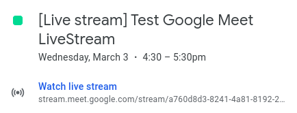

# Livestream on Google meet and Record the Meeting.

Here is a summary of the information that you need to know in order to Livestream your Google Meet Meeting and have view-only participants join in on the call.

**Details:**

There would be 2 Meeting Invites for the Livestream Meeting:

1. One for the organizers, who would be on the call and be sharing their screens. It will have the option to join the meeting itself or join the livestream

2. Another one for the view only attendees with an option to only join the Livestream.

**On the Viewer End**

Viewers see meeting partcipants video and the presented screen. [Here's](https://drive.google.com/file/d/1vJlfBU-BoJUXmqpog4ykwyYCx5UZea8P/view?usp=sharing) the recording of a Test Google Meet Livestream. This recorded stream can be later uploaded to YT.

Only redhat.com accounts can view the Livestream for now. For external organizational access we need Administrative [permissions to enable that](https://support.google.com/a/answer/9055446).

**How to Setup**

Detailed Steps here: https://support.google.com/meet/answer/9308630?co=GENIE.Platform%3DDesktop&hl=en&authuser=1&oco=0

tl;dr
1. Set up a normal google meet call with the participants of the migration and after adding the Google Meet conferencing link to the meeting, Next to `Join with Google Meet`, click `Down arrow` and then `Add live stream`.

2. Once the meeting is created, Click the live stream event you created and then `Edit`, at the top, click `More actions` and then `Create view-only event`. This is the second view-only event where we intend to invite the viewers.